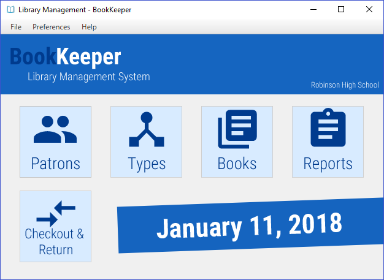
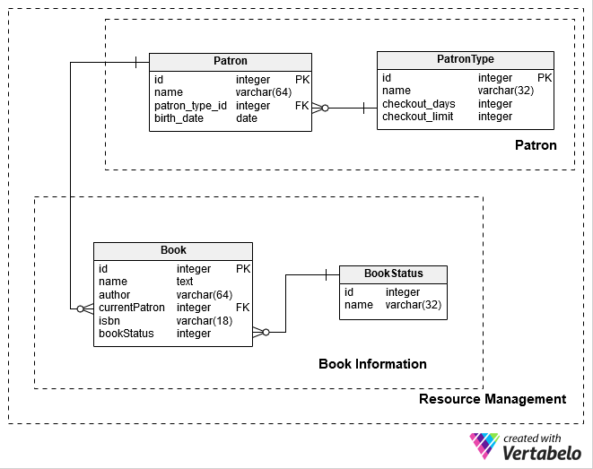
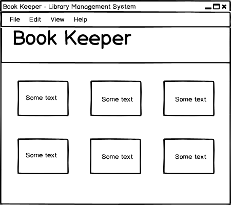

## BookKeeper - Library Management System
BookKeeper was designed for the management of large scale libraries from the ground up. 

### Usage
BookKeeper requires Java 8. If java 8 is not installed, the program will use a bundled JVM to execute.

### Generating Executable
```
javapackager -deploy -native image -Bruntime="C:\Program Files\Java\jdk1.8.0_131\jre" -outdir building -outfile BookKeeper -srcfiles
   application.jar -appclass library.fx.FXInitializer -name BookKeeper -title "BookKeeper - Library Management System"
```
Used for creating a executable file with a bundled-JVM using the JDK-bundled `javapackager` tool.

### Features
* Quickly editable patron information and catalogue information
* Allows filtering and sorting in any table view
* Includes customization of patron types
* Generates reports in a matter of seconds
* Allows librarians to override the system using their judgement
* Cross Platform and can run on Windows, Linux, and MacOS 
* Includes fully-featured interactive documentation featuring images and videos 

### Screenshots
#### Main Window:


### Planning
#### Database

###### *[Vertabelo](https://www.vertabelo.com/) was used to aid the design of the database*
The layout of the database is designed to encourage modularity, e.g. changes 
in the patron table should be reflected in the book table automatically, without 
knowledge of the specific patron entry.


###### *Balasmiq mockup was used to design wireframes and aid in planning*
More planning images can be found [here](img/mockup). These planning documents were modified 

#### Technologies Used
* Gluon Scenebuilder - used to quickly create JavaFX layouts
* IntelliJ IDEA - used to write Java code efficiently and quickly
* Java 8 - used to write efficient and robust code
* JavaFX - used to create general UI layout
* Git - used for version control
* Skeleton - used in application help for styling
* Adobe Illustrator - used to customize and design application icons
* HTML & CSS - used to create application help

### Technical Documentation
Documentation (javadocs) can be found inside javadocs or [here](javadoc/index.html)

### About
Written by Srikavin Ramkumar for the FBLA Coding and Programming Competition.
